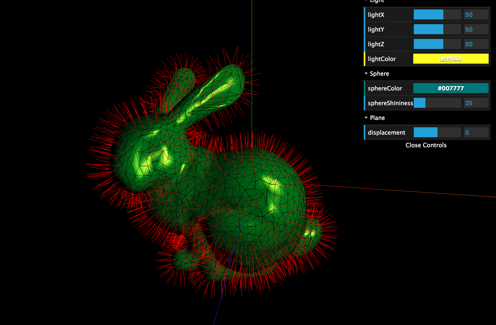

# Rapport Daehli Nadeau-Otis

[Daehli Nadeau-Otis](https://git.unistra.fr/nadeauotis/P4x/blob/master/TP3/src/daehli.md)

# Manipulation de maillages

Lors du TP précédent, nous nous étions intéressés à l'aspect visuel de la surface des objets. Dans ce TP, nous nous focaliserons sur leur forme.

Le travail se fera en 2 étapes : charger des données, puis les transformer.

## Import de maillages

Définition : dans un programme informatique, *importer* consiste à lire des données, généralement stockées dans un fichier, dans un format non utilisable tel quel par le-dit programme, et les convertir de sorte que le programme puisse les comprendre et les manipuler.

- Utiliser la classe importOBJ (bibliothèque importOBJ.js fournie)
pour créer un Mesh dont la géométrie est décrite dans un fichier OBJ et l'ajouter à la scène.
Quelques fichiers OBJ sont fournis à titre d'exemples.

L'objet importOBJ s'utilise de la manière suivante :
```
var importer = new THREE.importOBJ();
importer.load('bunny.obj', function(mesh) {
  // le paramètre mesh est un objet du type THREE.Mesh dont
  // le champ geometry.vertices contient les positions des sommets lus et
  // le champ geometry.faces contient les faces lues (uniquement les indices des sommets a, b et c sont initialisés)
});
```

- Vérifier que les données sont bien importées.

## Manipulation des normales

Maintenant que nous avons chargé une forme plus complexe et plus intéressante à manipuler que de simples sphères, nous pouvons attaquer les modifications sur la forme elle-même.

L'exercice suivant revient en fait à réimplémenter les fonctionnalités des méthodes `computeFaceNormal` et `computeVertexNormals` de la classe `Geometry`. Il est évident qu'utiliser ces méthodes n'est pas le travail attendu.

Soit la forme chargée, stockée en mémoire dans la variable `geometry` de type `Geometry` :
- Calculer les normales des faces de l'objet et les stocker dans le champ `geometry.faces[i].normal`pour chaque face d'index `i`.
- Dans un premier temps, affecter les normales des faces aux normales des sommets au sein de chaque face (champs `geometry.faces[i].vertexNormals[0..2]`).
- Associer un MeshLambertMaterial au mesh (`mesh.material = ...`) . N'oubliez pas qu'il faut une lumière dans la scène pour que l'objet puisse être éclairé. Constater que le rendu est de type Flat Shading (même couleur au sein de chaque face triangulaire).
- Calculer les normales des sommets comme la moyenne des normales des faces incidentes à chaque sommet. Essayer de trouver un algorithme efficace pour faire cela.
- Constater que le rendu des couleurs est maintenant lisse.



## Déformation du maillage via le Vertex Shader

Le maillage va être déformé à l'aide de modifications du Vertex Shader :
- Utiliser le ShaderMaterial du TP précédent pour faire le rendu de l'objet.
- Passer au Vertex Shader en variable uniform un nombre flottant variant en boucle entre 0 et 2 PI et dont la valeur est incrémentée à chaque frame, puis utiliser le sinus de cette valeur pour déplacer plus ou moins les sommets le long de leur normale dans le Vertex Shader.
- Proposer (et implémenter si possible) 1 ou 2 déformations du maillage utilisant les capacités du vertex shader.

## Notes

N'oubliez pas que three.js offre des classes dites [*helper*](http://threejs.org/examples/#webgl_helpers) pour vous aider au cours de vos développements !

Des shaders de l'algorithme d'éclairage de phong sont disponibles dans le répertoire du TP pour ceux qui n'auraient pas réussi à terminer le TP2.
